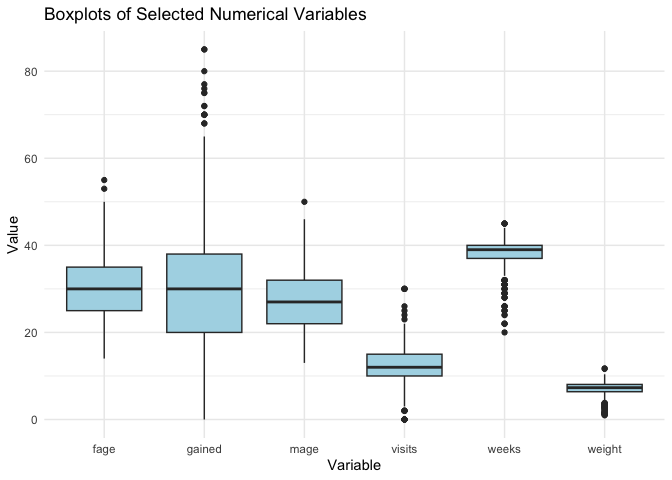
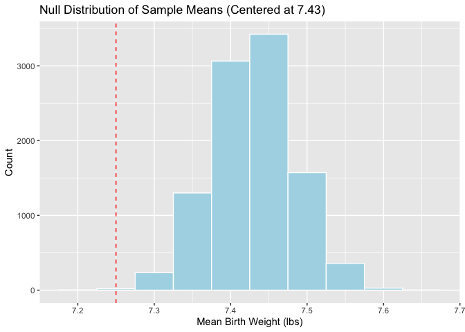

Hey mason, I did this lab on bootstrapping. I think bootstrapping is
intuitive to do in r, but my feedback is probably that it will be more
helpful if there are more instructions provided on how to do the first
question of bootstrapping, because we didn’t learn about non-parametric
tests in previous stats classes, and I was googling and watching youtube
videos to fully grasp the underlying logic of bootstrapping techniques.
But once I got through the logics, I find the codes easy and smooth!

### Load packages and data

    library(tidyverse) 
    library(tidymodels)
    library(openintro)
    library(ggplot2)
    library(dplyr)
    library(tidyr)

### Exercise 1

categorical variables: mature, premie, marital, lowbirthweight, gender,
habit, and whitemom numerical variables: fage, mage, weeks, visits,
gained, and weight Each case in the data represent one new born baby,
there are 1000 of them in the dataset.

And according to the boxplot, there are a lot of outliers in many of the
nnumeric variables despite having a large sample size of 1000…

    data(ncbirths)
    print(ncbirths)

    ## # A tibble: 1,000 × 13
    ##     fage  mage mature   weeks premie visits marital gained weight lowbirthweight
    ##    <int> <int> <fct>    <int> <fct>   <int> <fct>    <int>  <dbl> <fct>         
    ##  1    NA    13 younger…    39 full …     10 not ma…     38   7.63 not low       
    ##  2    NA    14 younger…    42 full …     15 not ma…     20   7.88 not low       
    ##  3    19    15 younger…    37 full …     11 not ma…     38   6.63 not low       
    ##  4    21    15 younger…    41 full …      6 not ma…     34   8    not low       
    ##  5    NA    15 younger…    39 full …      9 not ma…     27   6.38 not low       
    ##  6    NA    15 younger…    38 full …     19 not ma…     22   5.38 low           
    ##  7    18    15 younger…    37 full …     12 not ma…     76   8.44 not low       
    ##  8    17    15 younger…    35 premie      5 not ma…     15   4.69 low           
    ##  9    NA    16 younger…    38 full …      9 not ma…     NA   8.81 not low       
    ## 10    20    16 younger…    37 full …     13 not ma…     52   6.94 not low       
    ## # ℹ 990 more rows
    ## # ℹ 3 more variables: gender <fct>, habit <fct>, whitemom <fct>

    ## Check for the outliers in the numerical variables

    # GPT showed me a really smart way to do the boxplot without copying and pasting things over and over... 

    ## change the data to long format
    ncbirths_long <- ncbirths %>%
      select(fage, mage, weeks, visits, gained, weight) %>%
      pivot_longer(cols = everything(), names_to = "variable", values_to = "value")

    # plot all numeric variables together
    ggplot(ncbirths_long, aes(x = variable, y = value)) +
      geom_boxplot(fill = "lightblue") +
      labs(title = "Boxplots of Selected Numerical Variables",
           x = "Variable",
           y = "Value") +
      theme_minimal()

    ## Warning: Removed 209 rows containing non-finite outside the scale range
    ## (`stat_boxplot()`).

### Exercise 2

The mean weight of babies among white mothers is 7.25 pounds, and past
study shows it’s 7.43 in population. The following criteria for
conducting simulation-based inference is satisfied: independence of
observation, large sample sizes, and a not necessarily normally
distributed variable (there are too many outliers!).

    ncbirths_white <-ncbirths %>%
          filter(whitemom == "white")

    ncbirths_white

    ## # A tibble: 714 × 13
    ##     fage  mage mature   weeks premie visits marital gained weight lowbirthweight
    ##    <int> <int> <fct>    <int> <fct>   <int> <fct>    <int>  <dbl> <fct>         
    ##  1    19    15 younger…    37 full …     11 not ma…     38   6.63 not low       
    ##  2    21    15 younger…    41 full …      6 not ma…     34   8    not low       
    ##  3    NA    16 younger…    38 full …      9 not ma…     NA   8.81 not low       
    ##  4    20    16 younger…    37 full …     13 not ma…     52   6.94 not low       
    ##  5    30    16 younger…    45 full …      9 not ma…     28   7.44 not low       
    ##  6    NA    16 younger…    42 full …      8 not ma…     34   8.81 not low       
    ##  7    NA    16 younger…    38 full …     12 not ma…     30   7.13 not low       
    ##  8    21    16 younger…    38 full …     15 not ma…     75   7.56 not low       
    ##  9    NA    16 younger…    40 full …      7 not ma…     35   6.88 not low       
    ## 10    14    16 younger…    40 full …     12 not ma…      9   5.81 not low       
    ## # ℹ 704 more rows
    ## # ℹ 3 more variables: gender <fct>, habit <fct>, whitemom <fct>

    mean(ncbirths_white$weight)

    ## [1] 7.250462

From the null distribution, the dashed line is outside of the range of
the null distribution, suggesting that there is probably a significant
difference.

The p value &lt; .001, meaning that the mean of the bootstrapping sample
is significantly different from the estimate of 7.43. Since the
bootstrapping sample is drawn from the ncbirths\_white, this result
suggests that the mean of baby weight of white mothers are significantly
different from previous study.

    bootstrap_dist <- ncbirths_white %>%
      specify(response = weight) %>%
      generate(reps = 10000, type = "bootstrap") %>%
      calculate(stat = "mean")

    ## NOTE: reps = 1000 means that the bootstrapping has been repeated for 1000 times, and the "stat" represents the mean baby weight of each of the re-sampled 1000 samples, not 1000 babies!

    bootstrap_dist <- bootstrap_dist %>%
      mutate(stat = stat - mean(stat) + 7.43) 

    ## stat - mean(stat) is to mean center the bootstrapped means around 0, and + 7.43 is to re-center this new distribution so that the center is 7.43, the hypothesized population mean. Together, stat - mean(stat) + 7.43) means to simulate the null hypothesis that the true population mean is 7.43.

    ggplot(bootstrap_dist, aes(x = stat)) +
      geom_histogram(binwidth = 0.05, fill = "lightblue", color = "white") +
      geom_vline(xintercept = 7.25, color = "red", linetype = "dashed") +
      labs(title = "Null Distribution of Sample Means (Centered at 7.43)",
           x = "Mean Birth Weight (lbs)",
           y = "Count")

    # get distance from null (in absoluate value)
    distance <- abs(7.25 - 7.43)
    distance

    ## [1] 0.18

    # distance is 0.18, but for better clarity, I didn't use distance below, just abs(7.25 - 7.43)!

    # calculate p-value (two-tailed)
    bootstrap_dist %>%
      summarize(p_value = mean(abs(stat - 7.43) >= abs(7.25 - 7.43)))

    ## # A tibble: 1 × 1
    ##   p_value
    ##     <dbl>
    ## 1  0.0009

    ## abs(stat - 7.43) represents: how far is each simulated sample mean (centered) from the hypothesized mean of 7.43?

    ## abs(7.25 - 7.43) represents: how far is the observed sample mean from 7.43?

### Exercise 3

H0: 6.83 = 7.14 (well not in a mathematical sense, but you get the
point!) H1: 6.83 ≠ 7.14

    # plot two numeric variables together

    ncbirths%>%
      filter(!is.na(habit)) %>%
      filter(!is.na(weight)) %>%
      ggplot(aes(x = habit, y = weight, fill = habit)) +
      geom_boxplot(alpha = 0.7) +
      labs(
        title = "Birth Weight by Maternal Smoking Habit",
        x = "Maternal Habit",
        y = "Birth Weight (lbs)"
      ) +
      theme_minimal() +
      scale_fill_manual(values = c("nonsmoker" = "lightblue", "smoker" = "salmon")) +
      theme(legend.position = "none")

    ncbirths %>%
      group_by(habit) %>%
      summarize(mean_weight = mean(weight)) %>%
      filter(!is.na(habit)) %>%
      filter(!is.na(weight))

    ## Warning: There was 1 warning in `filter()`.
    ## ℹ In argument: `!is.na(weight)`.
    ## Caused by warning in `is.na()`:
    ## ! is.na() applied to non-(list or vector) of type 'closure'

    ## # A tibble: 2 × 2
    ##   habit     mean_weight
    ##   <fct>           <dbl>
    ## 1 nonsmoker        7.14
    ## 2 smoker           6.83

    ## mean weight for smoker is 6.83, for nonsmoker is 7.14

There is not a statistically significant difference between the sample
mean and the bootstrapped mean, p = .5, meaning that there is no
difference in baby weight between smokers and nonsmokers. 95% CI: \[.06,
.57\]

    bootstrap_diff <- ncbirths %>%
      filter(!is.na(habit)) %>%
      filter(!is.na(weight)) %>%
      specify(weight ~ habit) %>% ### compare the distribution of birth weight across different groups of habit (smoker/nonsmoker)
      generate(reps = 1000, type = "bootstrap") %>%
      calculate(stat = "diff in means", order = c("nonsmoker", "smoker"))

    # bootstrap_diff contains 1000 differences between smoker/nonsmoker in group means, one for each re-sample.

    # get the observed difference in mean among the actual sample
    obs_diff <- ncbirths %>%
      filter(!is.na(habit)) %>%
      filter(!is.na(weight))%>%
      specify(weight ~ habit) %>%
      calculate(stat = "diff in means", order = c("nonsmoker", "smoker"))

    # p value & CI

    bootstrap_ci <- bootstrap_diff %>%
      get_confidence_interval(level = 0.95, type = "percentile") 

    bootstrap_ci ## CI

    ## # A tibble: 1 × 2
    ##   lower_ci upper_ci
    ##      <dbl>    <dbl>
    ## 1   0.0541    0.561

    bootstrap_diff %>%
      summarize(p_value = mean(abs(stat) >= abs(obs_diff$stat))) ## p-value

    ## # A tibble: 1 × 1
    ##   p_value
    ##     <dbl>
    ## 1   0.489

    ## this is to compare the mean of all bootstrapped mean diff in 1000 re-sample (absolute value) with the actual mean difference in sample

### Exercise 4

1.  I calculated the max age of mature mom and min age of nonmature mom,
    and the cutoff likely lies between those two values. The youngest
    “mature” mother is 35. The oldest “younger” mother is 34, so the
    cutoff is 35 years old.

<!-- -->

    ncbirths_white %>%
      group_by(mature) %>%
      summarise(
        min_age = min(mage, na.rm = TRUE),
        max_age = max(mage, na.rm = TRUE)
      )

    ## # A tibble: 2 × 3
    ##   mature      min_age max_age
    ##   <fct>         <int>   <int>
    ## 1 mature mom       35      50
    ## 2 younger mom      15      34

#### compare the differences

12 & 13. There is not a statistically significant difference in the
proportion of low birth weight babies between mature and younger moms, p
= .53. 95% CI: \[-.09, .03\]. We are 95% confident that the true
difference in proportions of low birthweight babies between younger
mothers and mature mothers falls between -0.09 and 0.03.

    ncbirths <- ncbirths %>%
      filter(!is.na(lowbirthweight), !is.na(mature))

    # bootstrapped diff in proportion
    bootstrap_prop <- ncbirths %>%
      specify(lowbirthweight ~ mature, success = "low") %>% ## success = low is to calculate proportions of the category labeled "low" in the lowbirthweight variable
      generate(reps = 1000, type = "bootstrap") %>%
      calculate(stat = "diff in props", order = c("younger mom", "mature mom"))

    # actual observed diff in proportion
    obs_prop_diff <- ncbirths %>%
      specify(lowbirthweight ~ mature, success = "low") %>%
      calculate(stat = "diff in props", order = c("younger mom", "mature mom"))

    # p value
    bootstrap_prop %>%
      summarize(p_value = mean(abs(stat) >= abs(obs_prop_diff$stat)))

    ## # A tibble: 1 × 1
    ##   p_value
    ##     <dbl>
    ## 1   0.525

    # CI
    bootstrap_ci <- bootstrap_prop %>%
      get_confidence_interval(level = 0.95, type = "percentile") 

    bootstrap_ci

    ## # A tibble: 1 × 2
    ##   lower_ci upper_ci
    ##      <dbl>    <dbl>
    ## 1  -0.0895   0.0302
